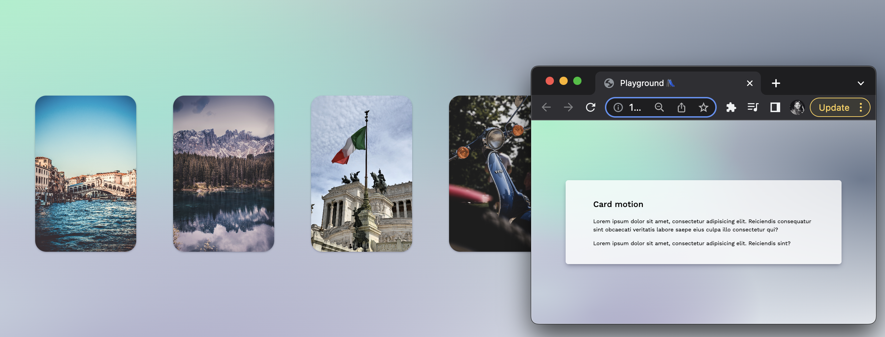

## Movie filter

> Animation of popular movies from the (TMDB) API in a responsive grid layout.



Featuring:

- This is a [React.js](https://reactjs.org/) app deployed with `create vite`.
- Its objective lists out content from (TMDB's API) in a CSS grid container.
- Animation makes use of [Framer Motion API](https://www.framer.com/docs/).
- `AnimatePresence` animates components that are removed from the React tree.

Dependencies:

```json
"dependencies": {
  "framer-motion": "^7.6.1",
  "react": "^18.2.0",
  "react-dom": "^18.2.0"
}
```

Regards, <br />
Luigi Lupini <br />
<br />
I ❤️ all things (🇮🇹 / 🛵 / ☕️ / 👨‍👩‍👧)<br />

This is a [Next.js](https://nextjs.org/) project bootstrapped with [`create-next-app`](https://github.com/vercel/next.js/tree/canary/packages/create-next-app).

## Getting Started

First, run the development server:

```bash
npm run dev
# or
yarn dev
```
